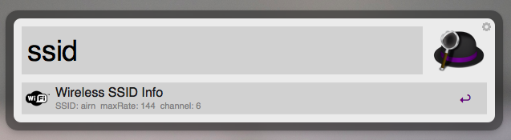
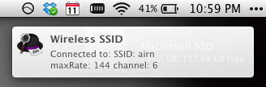

Alfred 2 extension designed to display the current Wireless SSID information both within the Alfred interface, as well as in Notification Center.

Screenshot
----------

Alfred Window  
  

Notification  
  

Contact
-------
[@davidklem](http://twitter.com/davidklem) - Follow me on Twitter  
[@klem](http://alpha.app.net/klem) - Follow me on App.net  
[GitHub](https://github.com/dklem?tab=repositories) - Check out my other workflows and projects  
